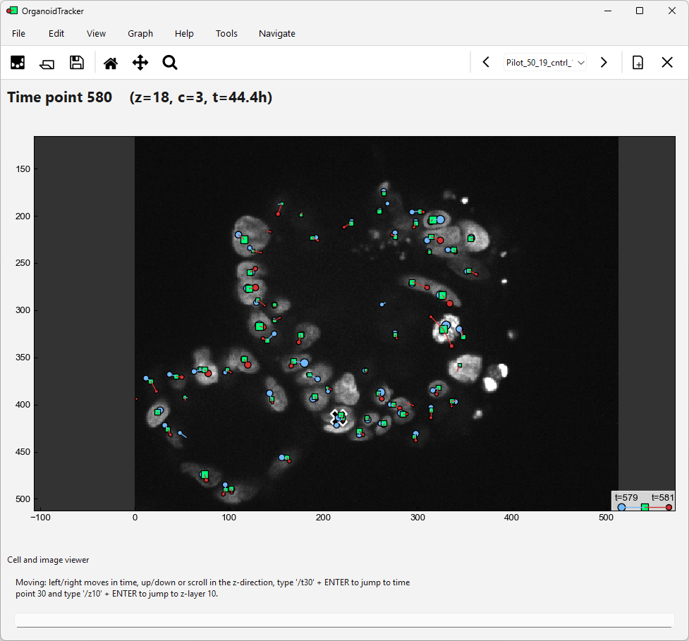

 OrganoidTracker
================================================

[Publication in PLOS ONE]

Program for tracking cell nuclei in (intestinal) organoids over time. Uses a convolutional neural network for nucleus detection, a min-cost flow solver ([Haubold, 2016]) for linking nuclei over time and tools for manual error correction.

Features
--------

* Manual tracking with live error-detection.
* Automated cell detection using a convolutional neural network based on U-net.
* Support for automatically linking nuclei over time using a min-cost flow solver ([Haubold, 2016])
* Supports [TIFF files, TIFF series, Leica LIF files and NIKON nd2 files](manuals/IMAGE_FORMATS.md).
* [Plugin API with live-reload for fast data analysis](manuals/PLUGIN_TUTORIAL.md)

Screenshot
----------

Intended workflow
-----------------
1. Do some manual tracking to obtain ground truth data and training data.
2. Train a neural network.
3. Apply the automated tracker on some new time lapse movie.
4. Correct the errors in the tracking data of that time lapse movie.
5. Use the corrected tracking data as additional training data for the neural network.
6. Want to track another time lapse movie? Go back to step 3.

[Tutorial on manual tracking](manuals/MANUAL_TRACKING)  
[Tutorial on automated tracking](manuals/AUTOMATIC_TRACKING)

Installation
------------
OrganoidTracker must be installed using Anaconda. See the [installation] page for details. If you are updating from an older version of OrganoidTracker, its dependencies might have changed, and in that case you also need to visit the [installation] page.

Running the main program
------------------------
Open an Anaconda Prompt, activate the correct environment and navigate to the 
The `organoid_tracker.py` script starts a graphical program that allows you to visualize and edit your data.

Reading the manual
------------------
After you have installed the software, please have a look at the [manual]. The manual is also available from the `Help` menu in the program; this works even when you're offline.

Pre-trained neural networks
---------------------------
1. [The original published network](https://doi.org/10.17026/dans-274-a78v) - for images with low background noise, 0.32 μm/px, z-step 2 μm
2. [For lower resolution](https://drive.google.com/file/d/1WVGWlR7aHD2w8MWgrGp755MZR6FLPL8V/view?usp=sharing) - for images with low background noise, **0.41 μm/px**, z-step 2 μm

API
---
You can also use OrganoidTracker as a library to write your own scripts. All public functions in OrganoidTracker have docstrings to explain what they are doing. As a starting point for using the API, see the [API] page.

Using a Jupyter Notebook
------------------------
It's possible to use OrganoidTracker from Jupyter Notebooks. Just install the `notebook` conda package into your OrganoidTracker environment and everything should be ready. Detailed instructions to get you started are available at the [Jupyter] manual page.

Editing the source code
-----------------------
Install the program as normal, and then point your Python editor (PyCharm or Visual Studio Code are recommended) to this directory. Make sure to select the `organoid_tracker` Anaconda environment as the Python environment.

License and reuse
-----------------
The [files dealing with the neural network](organoid_tracker/position_detection_cnn) are licensed under the MIT license. This is indicated at the top of those files. Other files are licensed under the [GPL license](LICENSE.txt). Please cite the [publication in PLOS ONE] if you're using this work.

[API]: manuals/API.md
[installation]: manuals/INSTALLATION.md
[manual]: manuals/INDEX.md
[Jupyter]: manuals/JUPYTER_NOTEBOOK.md
[Publication in PLOS ONE]: https://doi.org/10.1371/journal.pone.0240802
[Haubold, 2016]: https://doi.org/10.1007/978-3-319-46478-7_35
