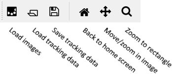

# AI_track manual

Welcome to the AI_track manual! This document will tell you how to use the "visualizer", the program that displays all the images and the annotations.

Tutorials
---------
* [Tutorial for semi-automated tracking](AUTOMATIC_TRACKING.md)
* [Tutorial for writing a plugin for AI_track](PLUGIN_TUTORIAL.md)


For reference
-------------
* [Installation instructions](INSTALLATION.md)
* [Supported image formats](IMAGE_FORMATS.md)
* [Scripts reference](SCRIPTS.md)
* [Programming API](API.md)

Getting started
---------------
The program always displays your images in the center. Using the button on the menu bar, or using `File` -> `Load images...` you can load some images. You can load tracking data on top of that, or alternatively you can manually track the cells. The graphical program *cannot* automatically track cells, for this you need to use the other scripts. However, the program can generate configuration files for you, so that you don't need to spend too much time on the command line. 🙂

To load the tracking data, use the button on the toolbar, or use `File` -> `Load tracking data...`. If your tracking data contains links between the time points, then `Graph` -> `Interactive lineage tree...` will show a lineage tree of your tracking data.

  
*The toolbar of the program.*

Now would be a good moment to verify that you can actually save the tracking data; do so using `File` -> `Save tracking data...` or using the button on the toolbar. 

Manual tracking and error correction
------------------------------------
You cannot edit tracking data from the main screen. Instead, you need to use `Edit` -> `Manually change data...` to open the data editor (or just press `C`). In this editor, you can select up to two cells at once by double-clicking them. Using the Insert, Shift and Delete keys, you can insert, shift or delete cells or links. Press `C` again to exit the view.

### Working with (cell) positions
To insert positions, make sure you have no cell selected, and then press the Insert key. To delete that cell position again, make sure that you have only selected that cell, and press the Delete key.

If you press Shift while having a single cell selected, that cell will be moved to your mouse psotion. The shape and links of the cell will be preserved.

Undo and Redo functions are available from the Edit menu. You can also use the Control+Z and Control+Y keyboard shortcuts, respectively.

### Working with links
To insert links between two positions, select two positions at two consecutive time points and press the Insert key. Select two positions and press Delete to delete the link between the two again.

A nice shortcut exists where if you have selected one single cell, then place your mouse cursor at the next or previous time point, and then press insert. The program will then both insert a position at your mouse cursor and create a link from the selected cell position to the newly added cell positions. This can be used to quickly track cells.

### Futher details
Links cannot skip time points. If you insert a link between two cells that are not in consecutive time points, then additions cell positions will be created in between the selected time points.

Links are used to tell the program that two cell positions at different time points actually represent the same biological cell. Therefore, you cannot create a link from one cell position in a time point to another cell position in the same time point. If you try anyways, a so-called *connection* will be made. You can write plugins to do something with those connections. You can also automatically create connections for all cells within a certain distance of each other, see `Edit` -> `Connect positions by distance...`

The data axes editor
--------------------
Say you want to know how far along a particle is along an axis. This custom axis does not align with the x, y or z axis. For example, you are looking at cell migration from the intestinal crypt to the intestinal villus. Then you want to draw an axis from the crypt to the villus, and see how far along the cells are over time.

For this, you first need to draw the data axis. This is a manual process. Open the data editor (in the `Edit` menu, or press `C` in the main screen) and then the axis editor (again in the `Edit` manu, or alternatively press `A`).

You need to draw axis from the lowest point to the highest point. Hover you mouse at the start of the axis (the zero point) and press Insert. A marker will be added. Then move your mouse to another point and press Insert again to insert a line to this point from the previuos marker. If your axis is not a straight line, you can add more points and a spline will be drawn using those points.

You can add a second (or third, fourth, etc.) axis by deselecting the first axis (double-click) and then pressing Insert without having an axis selected. Every particle will be assigned to the axis that was nearest in the first time point.

For the next time point, you can either draw the axis again, or (if the particles haven't moved too much) you can simply press C to copy the selected axis from another time point over to this time point. You can repeat this until the whole experiment is analyzed.

If you select an axis and then press Delete, the whole axis will be deleted.

Plugin support
--------------

Any Python file you place in the `ai_track_plugins` folder that has a name starting with `plugin_` (so for example `plugin_extra_images.py`) will automatically be loaded. A very minimal plugin looks like this:

```python
from ai_track.gui import dialog

def get_menu_items(window):
    return {
        "Tools//Messages-Show Hello World... [Ctrl+W]":
            lambda: dialog.popup_message("My Title", "Hello World!"),
        "Tools//Messages-Show other message...":
            lambda: dialog.popup_message("My Title", "Nice weather, isn't it?")
    }
```

The `get_menu_items` function is automatically called. It is used here to add some custom menu options. The options are shown in the "Tools" menu, in the "Messages" category. (The name of the category is never shown, but menu options in the same category will always appear next to each other.) Ctrl+W is the shortcut for the menu option.

You can call any method in the Python standard library, the AI_track API (see API.md) and its dependencies. There is no sandbox implemented. You can access the currently loaded experiment using `window.get_experiment()`. o show a matplotlib figure, use `dialog.popup_figure(..)`.
