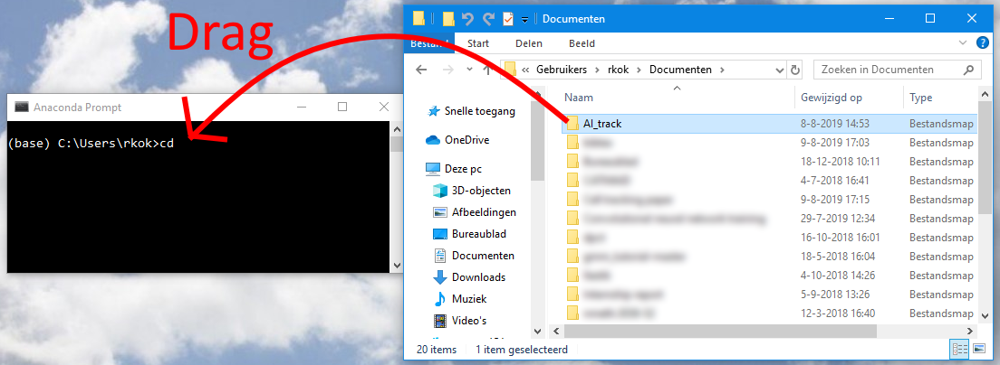

Installation instructions
=========================
[← Back to main page](./INDEX.md)

## Windows
**System requirements:**

* 64-bit Windows, version 7 and later
* Video card with CUDA 11 support and 2 GB of video RAM

**Additional system requirements for training the neural network:**

* Video card with CUDA 11 support and 11 GB of video RAM
* 8 GB RAM if you want to train without using the intermediary TFRecord files

First, make sure you have Anaconda or Miniconda installed. You can download them at [anaconda.com/distribution](https://www.anaconda.com/distribution/). You should install the Anaconda version that ships with Python 3, although the one that ships with Python 2 will also work (Anaconda will just download Python 3 afterwards.) Using the default installation options of Anaconda is fine.

Next, to run the scripts you first need to install the dependencies. Open the Anaconda Prompt (in the "All Programs" list of your start menu, there should now be a folder named Anaconda3, which contains the Anaconda Prompt). Use the command `cd path\to\folder\with\OrganoidTracker` (replace path with real path) to navigate to the directory you installed OrganoidTracker in. If you are not used to the command line, you can also type "`cd` ` `" (a `c`, a `d` and a space) and then drag in the OrganoidTracker folder and drop it in the command prompt, and then press Enter. See this illustration:

Once you're in the right directory, run the following two commands.

    conda create --name organoid_tracker --file spec-file-win64.txt
    activate organoid_tracker

The last command is necessary because Tensorflow 2 is not available in Anaconda. If you need to remove (the previous version of) OrganoidTracker, execute this command:

    conda env remove -n organoid_tracker

To test if the software is working, run `python organoid_tracker.py`. A window should pop up, from which you can load images and tracking data. See the Help menu for more information and tutorials.

However, you're not done yet. To use the neural network, you'll also need to install CUDA 11.0 ([developer.nvidia.com/cuda-11.0-update1-download-archive](https://developer.nvidia.com/cuda-11.0-update1-download-archive)) and cuDNN ([developer.nvidia.com/rdp/cudnn-download](https://developer.nvidia.com/rdp/cudnn-download)). While the installation of CUDA is straightforward, the installation of cuDNN is not. You'll first need to register for a (free) Nvidia account. Then, you'll need to download the right version of cuDNN: download the version for CUDA 11.0. Then, you'll need to very carefully follow the installation instructions. cuDNN does not have an installation wizard, so you have to move all downloaded files yourself to the right location.

## macOS and Linux
Unfortunately, OrganoidTracker has not been tested on any other OSes. If you're in for a challenge, here are some instructions. Feel free to ask the authors if you run into any problems, we're interested in getting OrganoidTracker to work on other OSes.

Download and install Anaconda/Miniconda and open the Anaconda Prompt. Use the `cd` command to navigate to the directory of OrganoidTracker. Run the following commands:

    conda create -n organoid_tracker -c ilastik-forge -c esri -c conda-forge  python=3.7 dpct matplotlib-base mahotas tifffile scikit-image scipy nd2reader opencv pyside2 tensorflow-gpu tensorflow-addons
    source activate organoid_tracker

The first command creates an Anaconda environment named "organoid_tracker" with all dependencies installed. The second command activates this environment. The third command installs Tensorflow, which only has a PIP package.

If you need to remove (the previous version of) OrganoidTracker, execute this command:

    conda env remove -n organoid_tracker

To test if the software is working, run `python organoid_tracker.py`. A window should pop up, from which you can load images and tracking data.

You'll also need to install CUDA 11.0 and cuDNN in order to use the neural network.
