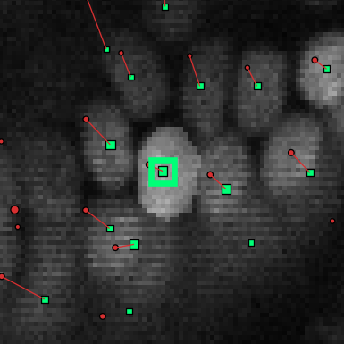
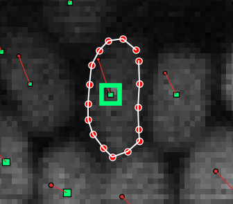

# Segmentation masks editor
[← Back to main page](index.md)

OrganoidTracker cannot segment nuclei/cells/etc. on its own, but it can view and edit existing segmentations.

### Opening the segmentation editor
OrganoidTracker expect segmentations to be stored as labeled images. These are images with an integer dtype, where all
background pixels are 0, the first object with label 1, the second object with label 2, and so on. If you want to
create such segmentations programmatically, then [this tutorial of scikit-image](https://scikit-image.org/docs/stable/user_guide/tutorial_segmentation.html) explains how to create such
segmentations for images of coins. Many segmentation algorithms (CellPose, StarDist, etc.) are able to produce images in
this format.

To load these labeled images together with the raw data, first load your images as usual, and then use the
`Append image channel...` button in the `Edit` menu. In the `View` menu, you can change the colormap
(`Set channel colormap`) of the segmentation channel to `Segmentation` to make it easier to see the labels.

After you've loaded the segmentation, you can open the segmentation editor. The segmentation editor is available in the
data editor. To open the segmentation editor, in the main screen first open the data editor
(`Edit -> Manually change data` or press `C`) and then open the segmentation editor (`Edit -> Edit segmentation masks`).

In this screen, first set which channel you want to use as the segmentation channel. This is done using
`Edit > Set segmentation image channel`. Your segmentation images need to be writable for this to work. If they are not,
that program will tell you that you need to convert your segmentation images to a folder of images, with one TIFF file
per time point (3D images) or one PNG file per time point (2D images).

### Making changes to the segmentation masks
Make sure the segmentation editor is open and that you have selected the correct channel as the segmentation channel.
Then, switch to the channel with the microscopy images on which the segmentation is based. (Channel switching is done
using the `Navigate` menu or the `,` and `.` keys.)

Double-click the annotation point (the green square) of the cell of which you want to edit the mask. This should
highlight the current segmentation:

If the cell doesn't yet have a segmentation mask, nothing will be highlighted yet until you draw something. The
segmentation mask is needs to intersect with the annotation point, as otherwise the program does not recognize the mask
as belonging to the cell.

You can now edit the segmentation mask. Editing is done by drawing shapes (polygons). Polygons look like this:

You can draw a new polygon by single-clicking on somewhere the image. A red dot will appear. Then, move the mouse to the
next point of the polygon and single-click again. Repeat this until you have drawn the polygon you want, like in the
image above. Then press Insert or Enter, and the polygon will be converted to pixels and added to the segmentation mask.

Polygons are 2D shapes, so you can only draw them on the current slice. To draw a 3D shape, draw the mask layer by
layer.

To delete part of the segmentation mask, draw a polygon like before, but then press Delete or Backspace at the end. To
delete an entire object, double-click the cell and press Shift+Delete.

