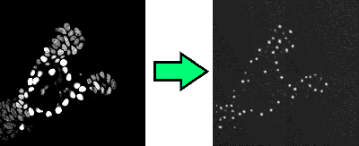
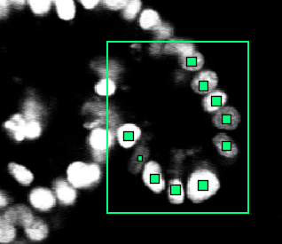

# Training the neural network
[← Back to main page](index.md)

If you want to train your own neural network, read on. Training your own neural network is a good idea if you're not satisfied with how the cell detection in your images is done. However, training requires a graphics card with at least 10 GB of VRAM. I'm using a NVIDIA GeForce RTX 2080 Ti card, which has enough video RAM for a batch size of 48 with images of 512x512x32 px.

## Some background information
The tracker uses three neural networks. The first one detects where cells are, the second detects how likely it is that a cell is currently dividing and the third detects how likely it is that two cells at subsequent time points are the same cell.

The first network, the network that detects nucleus centers, is a so-called image to image network. Given a microscopy image, it outputs small dots that represent the nucleus centers. See Figure 1. This transformation is a large mathematical function with a huge number of parameters. During training, these parameters are optimized. You might be familiar with fitting the parameters `a` and `b` in the function `f(x) = ax + b` to some point cloud; in essence a neural network is a more complex variant of this, where many simpler functions are stacked on top of each other.

  
Figure 1: The network goes from an input image to an image that shows where the nucleus centers are.

By giving the neural network a lot of examples of "here is a nucleus center" and "here is not a nucleus center", it "learns" to recognize cells on it's own. For this, it fits the parameters of the neural network such that the network gets better and better in reproducing the images you trained it on.

The other two networks are classification networks. They take one or two images as input, and output a single number (instead of another image, like the network above). Training still works in a similar way. For the division detection network, the network receives a lot of examples of cells, and optimizes all parameters such that it can decide whether a cell divides. For the linking network, it receives pairs of images centered around two nuclei, and learns to decide whether the images are displaying the same cell.

If you've not already done so, you should definitely look up some information on how convolutional neural networks work; there a lot of great videos and books. Tip: try a book for Keras or PyTorch beginners. These books tend to provide a practical introduction, while still covering enough theory so that the networks don't look like magical creatures anymore.

## Acquiring training data
First, you're going to need a lot of training data. The more and the more diverse the training data, the better. The training data should be a good sample of the data you eventually want to obtain. I'm using around 10000 data points (detected cells) from 10 different time lapses myself. In the OrganoidTracker GUI in the `View` menu there is an options to view how many detected positions you have in your experiment.

If you have less data, there are several options. You can download a pre-trained networks at [our Github page](https://github.com/jvzonlab/OrganoidTracker) and train it for more time steps on your data, for example up to step 125000 if the network was originally trained for 100000 steps. Compared to training a network for scratch, this allows you to get away with a lot less training data.

You can also download one of the fully annotated 3D+time time lapses from the [Cell Tracking Challenge](https://celltrackingchallenge.net/3d-datasets/) and add them to your dataset, provided those look similar enough.

Make sure that the data is correct! Even a low percentage of errors (1%) can already weaken the training. You don't need to annotate the entire image, OrganoidTracker will crop your image to the area where there are annotations. This cropping uses a simple cuboid (3D rectangle) shape. However, within the area you're annotating you need to annotate each and every cell, otherwise you're teaching the network that those things are not cells. See Figure 2.

  
Figure 2: OrganoidTracker automatically sees that you have only annotated part of the image, so you don't need to annotate the entire image. However, you do need to annotate each and every cell within that region.

## The training process
Open the data of all the experiments you're going to use in the OrganoidTracker GUI, switch to the "<all experiments>" tab and use `Tools` -> `Train a neural network` and pick the neural network to train. Run the resulting script.

By default, the training lasts for 50 epochs, but you can modify this in the `organoid_tracker.ini` file next to the script. Training will stop automatically if the results no longer improve on the validation set (which will be randomly created from the dataset you supplied).

Neural networks work differently from our own brains. If you change some microscopy settings, which makes the noise in the images different, then if you're unlucky the neural network will suddenly not recognize your nuclei anymore. Additionally, if you provide the network nuclei at a different resolution, it might no longer work.

To combat both effects, OrganoidTracker generates artificial data based on your input images. It makes cells brighter or darker and rotates them. This makes the algorithm less specific to your images. The program also randomizes the order in which it sees your training data, so that it is not training on a single experiment for a long time.

## Using image data of multiple channels
The `Tools` -> `Train a neural network` menu options each generate a folder with a configuration file `organoid_tracker.ini` in it. If you open it, you can see where the neural network is getting its image data from. 

An interesting setting here is `image_channels_x`, which `x` the number of the image dataset. Normally, the network is trained on just the first channel. You can change this here to another channel. This is necessary if the first channel does not properly identify the nuclei, for example because it is a brightfield channel.

You can also provide multiple channels, for example `image_channels_x = 3,4` which will first sum the third and fourth channel, and then train the network on the sum of those channels. (The first channel is channel 1, not 0, just like in the OrganoidTracker GUI.)

## Using data that is not from a time lapse
If you're using data that is not from a time-lapse (so just a sequence of unrelated images), or if the nuclei have moved so much that they're no longer close to themselves in the next time point, make sure to set `time_window_before` and  `time_window_after` to 0 in the `organoid_tracker.ini` file. Otherwise multiple time points will be used for recognition of the nuclei.