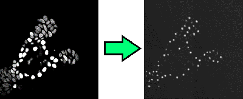
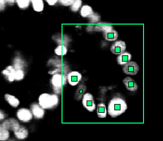

# Training the neural network
[← Back to main page](index.md)

If the [pretrained models](https://zenodo.org/records/17495402) for nucleus detection and tracking do not work well on your images, you can train your own neural network. 

## Requirements
*Enough vRAM*:  OrganoidTracker2.0 models were trained on an NVIDIA GeForce RTX 2080 Ti card with 11GB of vRAM, which was sufficient for a batch size of 48 with images of 512x512x32 px. Lower batch or image sizes can reduce memory requirements.
*Enough training data*: The training data for OrganoidTracker 2.0 consisted of ~200,000 cell detections and links across 1405 frames from multiple timelapse datasets (281h of imaging total). Smaller datasets can instead be used to finetune existing models.

## OrganoidTracker uses three neural networks
The tracker uses outputs from three neural networks to construct optimal tracks.

The **cell detection network** is an "image-to-image" network. Given a microscopy image as input, it outputs an "image" with small dots that represent the nucleus centers (Figure 1), from which we extract the coordinates of the cell centers. 

  
Figure 1: The network goes from an input image to an image that shows where the nucleus centers are.

The other two networks are classification networks. They take images as input and output a single number (instead of an image). Note that these input images are crops around a single cell center, so both the link and division networks depend on the performance of the position detection network. 

The **division detection network** works on a crop around a cell position for three consecutive timepoints and determines the probability that the cell is dividing in the middle frame. In this way, the "division score" is a feature of every cell center at every timepoint (except the first and final ones). 

The **link detection network** receives pairs of images centered around two nuclei and computes the probability that the images display the same cell. Thus, the "linking score" is a feature of many "possible" links, though the possible links are pruned based on a distance metric (i.e., only nearby neighbors are checked for links).

## Acquiring training data
You training images will ideally include as many examples as possible, be similar to you true experimental set-up, and represent the diversity of cell shapes and divisions that can occur. To check how many examples you have, you can use `View` -> `View statistics` to check how many detected positions you have in your experiment.

Your training data should also be **annotated**, with ground truth positions, divisions, and links marked. See [our guide on manual tracking](MANUAL_TRACKING.md) for how to do this in the OrganoidTracker GUI. 

Make sure that the data is correct! Even a low percentage of errors (1%) can already weaken the training. Note that:
* When training a position model, every position must be annotated, or the network learns to ignore things that are actually cells. However, OrganoidTracker will crop a 3D rectangle (xyz) around all positions in the training data, so it is sufficient to fully annotate only a subsection of your image (Figure 2). Note also the the z-location of the position also matters.
* For the division and link models, comprehensive annotation is less important, since the model works around a crop of the specified cell center. Nonetheless, these should be correct. Note that you do not need to generate the individual crops that are used as example inputs for the division and links models. Instead, by creating the "tree" that links positions in time, you provide enough information for the OrganoidTracker training procedure to create those crops itself during the training process.

  
Figure 2: OrganoidTracker automatically sees that you have only annotated part of the image, so you don't need to annotate the entire image. However, you do need to annotate each and every cell within that region.

### Automatic data augmentation
Training with the OrganoidTracker scripts automatically includes some data augmentation, which is meant to simulate subtle variations in microscope settings or cells that can arise. OrganoidTracker generates artificial data based on your input images by making them brighter or darker or rotating them and adds these modified examples to the training data.

The program also randomizes the order in which it sees your training data, so that it is not training on a single experiment for a long time.

## The training process
OrganoidTracker streamlines training by allowing you to load and visualize the training data and then generating the necessary script to run the training. 

**Load and select all training data**: Load all your training data, which should be a series of images and their associated tracks (i.e., ground truth annotations of positions, divisions, and links). Open each image (`File` -> `Load images...`) and its associated tracking data (`File` -> `Load tracking data...`) in their own tab. The GUI opens with an empty tab, but you must add additional ones (`File` -> `New project...`) to load more than one image. The dropdown menu in the upper right lists all the open tabs, so you can switch between them. The final tab is always labelled `<all experiments>`. Select that tab to train on all data simultaneously. 

**Generate a script to train one of the three models**: Go to `Tools` -> `Train a neural network` and pick the neural network you want to train. Type the name of the output directory (e.g., `model_positions`). After, you will be asked if you would like to start from a pretrained model. Select "No" to train a model from scratch, unless you want to finetune an existing model (see below). Select `Open that directory` in the final dialog box to find the script and config files for training that have been generated.

**Run the training**: Double click either the `*.bat` or `*.sh` file. You may also modify features of the training (*before* running the script) with the following parameters in the config file (i.e., `organoid_tracker.ini`):
* `epochs`: 50 (default, int), but OrganoidTracker uses an early stopping criterion based on changes in the loss of an automatically held out validation set. 
* `learning_rate`: (float) varies between the different models
* `patience`: 1 or 2 (default, int), number of epochs to keep training even if validation loss increases (as used in `PyTorch`); the model with lowest validation error is kept regardless of what you select
* `image_channels_x`, where `x` is the dataset number: 1 (default, int), which channel to train on. Can take multiple channels as a list (e.g., "3,4"). As in the GUI, the first channel is 1, not 0
* `time_window_before` and `time_window_after`: set to 0 if data are not timelapse or nuclei in adjacent frames are not close to each other for some other reason. Otherwise, multiple timepoints are used for nucleus recognition

## Troubleshooting

### What to do if you don't have enough training data
Perhaps after training and adjusting hyperparameters, your model is still not performing well on test data, and you suspect you do not have enough training data. You can:
* **Finetune an existing model with your smaller dataset**: If [our models](https://zenodo.org/records/17495402) or another pretrained model already has somewhat reasonable performance on your data, you could use your smaller dataset to finetune these models for better performance, rather than retraining from scratch (i.e., transfer learning). To do this, select the pretrained model when prompted by the GUI during the training setup process. It may also be useful to lower the learning rate and increase the patience, parameters which you can change in the config file. Otherwise, the pretrained model loads the same loss function and optimizer as when training from scratch.
* **Find published ground truth data that resembles yours**: If no existing model performs reasonably well and you only need more data, you may find published (and possibly annotated) data that you can use, provided that they look similar enough. For example, the [Cell Tracking Challenge](https://celltrackingchallenge.net/3d-datasets/) includes many fully annotated 3D timelapses.